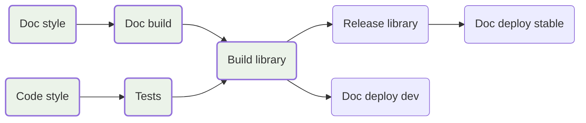
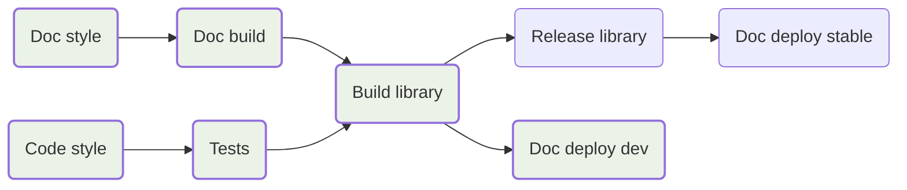
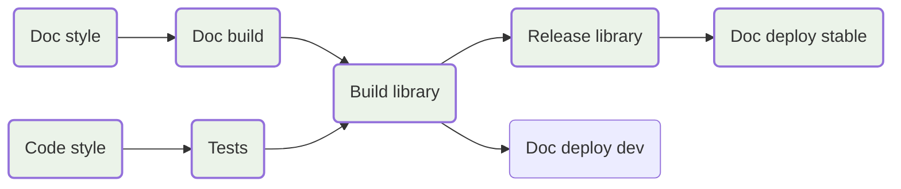

# Ansys actions

[![ansys][Ansys badge]][`actions.docs.ansys.com`]
[![CI-CD][CI-CD badge]][CI-CD yml]
[![MIT][MIT badge]][MIT url]

A repository containing a collection of [`GitHub Workflows`] to be reused by
projects in the Ansys ecosystem.

For more information on available actions and how to use them, see
[`actions.docs.ansys.com`].

## Recommended workflow strategy

The different actions provided by [`ansys/actions`] can be used to create a
simple but effective workflow.

The following lines describe the suggested workflows for various events, such as
pushing a new commit to a pull request, merging a commit to the main branch of a
repository, and performing a new release. Each image showcases the distinct job
steps declared in a YML file. Jobs highlighted in green signify that they
execute, while those with a grey background indicate that they do not execute.

For additional in-depth information refer to the poster [`CI/CD pipelines for
scientists`].

### Recommended workflow when pushing a new commit to a pull-request

This workflow is recommended to ensure that the code ready to be merged is
compliant with the project style, its code integrity, and that it is capable of
successfully generating all the desired library artifacts.

### Recommended workflow when merging a new commit to the main branch of a repository

This workflow is similar to the one for validating new code contributions in a
pull-request, but it also deploys the development documentation as new changes
were introduced in the main development branch.

### Recommended workflow when performing a new release

This workflow outlines the recommended steps for performing a new software
release, ensuring a smooth and well-documented process by deploying
the stable documentation at the end of the workflow.

[Ansys badge]: https://img.shields.io/badge/Ansys-ffc107.svg?labelColor=black&logo=data:image/png;base64,iVBORw0KGgoAAAANSUhEUgAAABAAAAAQCAIAAACQkWg2AAABDklEQVQ4jWNgoDfg5mD8vE7q/3bpVyskbW0sMRUwofHD7Dh5OBkZGBgW7/3W2tZpa2tLQEOyOzeEsfumlK2tbVpaGj4N6jIs1lpsDAwMJ278sveMY2BgCA0NFRISwqkhyQ1q/Nyd3zg4OBgYGNjZ2ePi4rB5loGBhZnhxTLJ/9ulv26Q4uVk1NXV/f///////69du4Zdg78lx//t0v+3S88rFISInD59GqIH2esIJ8G9O2/XVwhjzpw5EAam1xkkBJn/bJX+v1365hxxuCAfH9+3b9/+////48cPuNehNsS7cDEzMTAwMMzb+Q2u4dOnT2vWrMHu9ZtzxP9vl/69RVpCkBlZ3N7enoDXBwEAAA+YYitOilMVAAAAAElFTkSuQmCC
[`actions.docs.ansys.com`]: https://actions.docs.ansys.com/
[`ansys/actions`]: https://github.com/ansys/actions/
[CI-CD badge]: https://github.com/ansys/actions/actions/workflows/ci_cd.yml/badge.svg
[CI-CD yml]: https://github.com/ansys/actions/actions/workflows/ci_cd.yml
[MIT badge]: https://img.shields.io/badge/License-MIT-blue.svg
[MIT url]: https://opensource.org/blog/license/mit
[`GitHub Workflows`]: https://docs.github.com/en/actions/using-workflows/about-workflows/
[`CI/CD pipelines for scientists`]: https://scipy2023.pyansys.com/ci_cd.pdf
